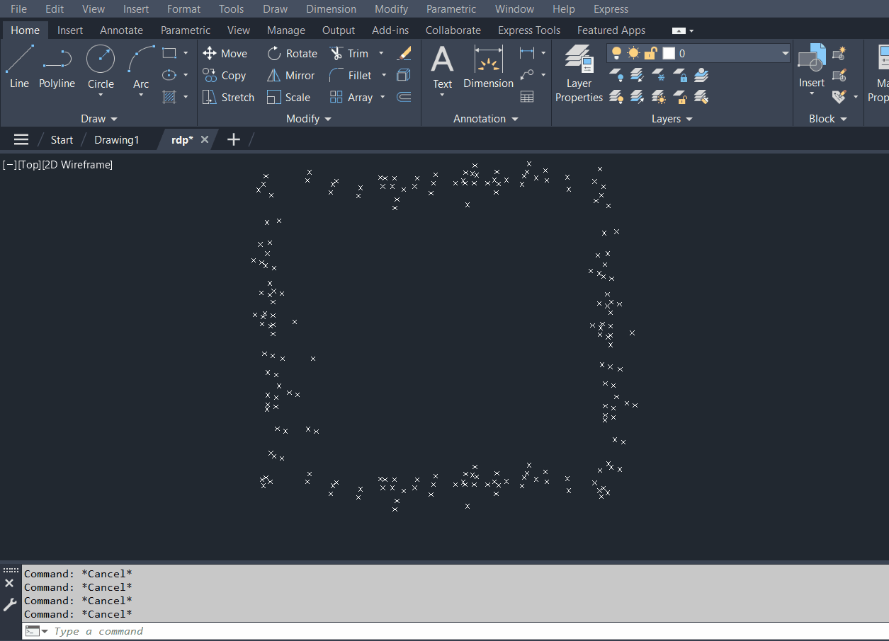

//Simple RDP Polyline
This is a small C++ project that implements the Ramer–Douglas–Peucker
algorithm for simplifying 2D polylines.  
A small example is included that shows how a noisy set of room boundary
points can be reduced to a clean outline.

//About the Algorithm
The core idea is to keep only the points that significantly change the
shape of the polyline.
1. Take the first and last point of the segment.
2. Measure how far each point deviates from the straight line between them.
3. If the largest deviation is greater than a chosen tolerance `epsilon`,
   that point is kept and the process is applied recursively.
4. Otherwise, all intermediate points are removed.

The tolerance `epsilon` has a major influence on the result:  
small values preserve nearly all details, while larger values produce a
much simpler outline.

//Files
- `RDP_Arx.h` – declarations of the RDP functions (2D version)
- `RDP_Arx.cpp` – implementation and a small test
- `demo.gif` – short clip showing noisy points and the simplified outline

//Demo

